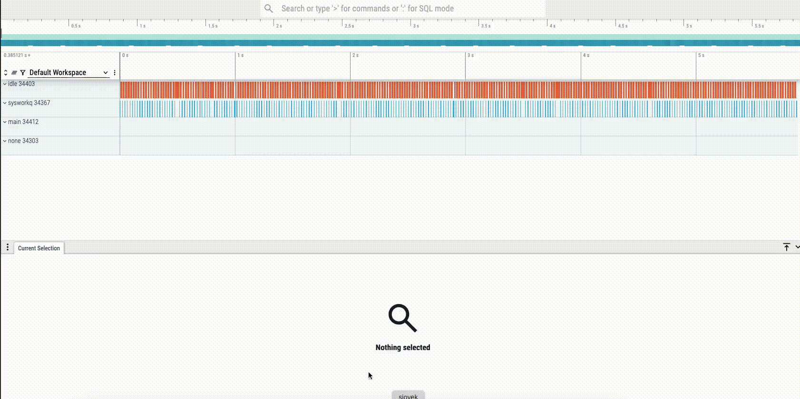

# TT-Zephyr-Platforms v18.7.0

[comment]: <> (We are pleased to announce the release of TT Zephyr Platforms firmware version 18.7.0 🥳🎉.)

Major enhancements with this release include:

[comment]: <> (H3 Performance Improvements, if applicable)

### New and Experimental Features

* Implement aiclk_ppm sweep handler

[comment]: <> (H3 External Project Collaboration Efforts, if applicable)

### Stability Improvements

* Reduce Blackhole Galaxy GDDR speed from 16G to 14G
* Update Wormhole FW blob
  * CMFW 2.35.0.0
    * Fix telemetry entry ENABLED_TENSIX_ROW
    * Add telemetry entries for ASIC_ID_{HIGH,LOW}

[comment]: <> (H1 Security vulnerabilities fixed?)

[comment]: <> (H2 API Changes, if applicable)

[comment]: <> (H3 Removed APIs, H3 Deprecated APIs, H3 New APIs, if applicable)

[comment]: <> (UL PCIe)
[comment]: <> (UL DDR)
[comment]: <> (UL Ethernet)
[comment]: <> (UL Telemetry)
[comment]: <> (UL Debug / Developer Features)
[comment]: <> (UL Drivers)
[comment]: <> (UL Libraries)

[comment]: <> (H2 New Samples, if applicable)

[comment]: <> (UL PCIe)
[comment]: <> (UL DDR)
[comment]: <> (UL Ethernet)
[comment]: <> (UL Telemetry)
[comment]: <> (UL Debug / Developer Features)
[comment]: <> (UL Drivers)
[comment]: <> (UL Libraries)

### Other Notable Changes

[comment]: <> (UL PCIe)
[comment]: <> (UL DDR)
[comment]: <> (UL Ethernet)
[comment]: <> (UL Telemetry)

#### Debug / Developer Features

* The `tenstorrent,vuart` virtual PCIe serial device is now the default for console I/O. The
  virtual uart supports multiple instances, so one instance may be used for console I/O while
  another instance may be used for e.g. RPC, tracing, coredump, profiling, or other
  functionality

* Zephyr's tracing subsystem may now be used over the virtual uart. For now it is limited to a
  an app
  [overlay](https://github.com/tenstorrent/tt-zephyr-platforms/blob/main/app/smc/tracing.conf)
  but plans are in place to integrate this feature into production firmware with support for
  dynamically configurable tracing

[comment]: <> (UL Drivers)
[comment]: <> (UL Libraries)

[comment]: <> (H2 New Boards, if applicable)

## Migration guide

An overview of required and recommended changes to make when migrating from the previous v18.6.0 release can be found in [v18.7.0 Migration Guide](https://github.com/tenstorrent/tt-zephyr-platforms/tree/main/doc/release/migration-guide-v18.7.0.md).

## Full ChangeLog

The full ChangeLog from the previous v18.6.0 release can be found at the link below.

https://github.com/tenstorrent/tt-zephyr-platforms/compare/v18.6.0...v18.7.0
